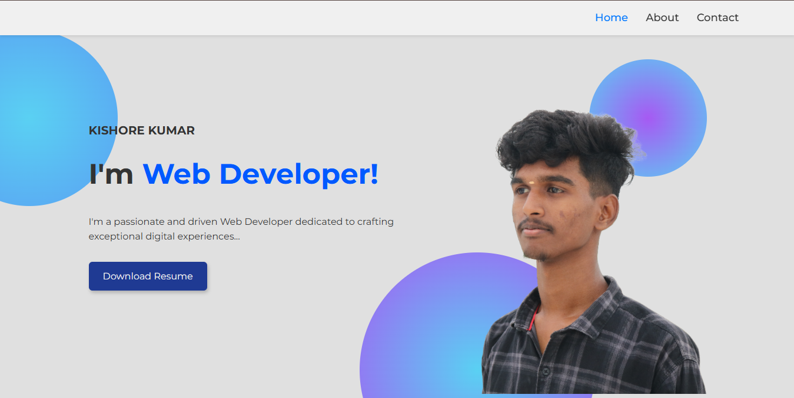

# My Portfolio Website

## About
A personal portfolio website developed to showcase my skills, projects, education, and contact information.

## Features
- Responsive Design
- About Me Section
- Projects Showcase
- Contact Section
- Clean UI

## Technologies Used
- HTML
- CSS
- JavaScript

## Project Structure
Portfolio/
│
├── index.html
├── styles.css
└── img/

## Preview

## Live Demo

🔗 https://skishore24.github.io/Portfolio/

## Installation
1. Clone the repository
2. Open index.html in browser

## Author
Kishore Kumar
